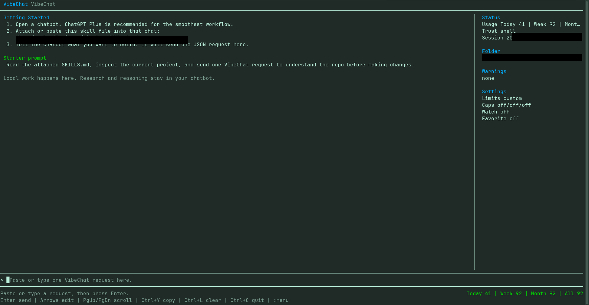

# VibeChat

> A local terminal bridge for working with ChatGPT, Claude, or another capable chatbot while it inspects, edits, and verifies code in a folder you choose.

This MVP was generated with AI assistance using ChatGPT Plus and GPT 5.5 High, then refined and tested inside the local repo.

VibeChat gives the chatbot a structured local execution surface without asking it to control your computer directly. You paste one request into VibeChat, it runs the requested local operations, copies the complete JSON response to your clipboard, and you paste that response back into the chatbot for the next step.

## Why VibeChat?

Chatbots are good at research, planning, and reasoning. Your terminal is where the real repository, files, tests, and git state live. VibeChat makes that handoff deliberate and repeatable:

- The chatbot plans the next local action using `SKILLS.md`.
- VibeChat performs local reads, edits, searches, shell commands, and checks in the active folder.
- The full structured result is copied to the clipboard automatically.
- The terminal stays readable by showing summaries and completed operations instead of raw JSON.

This is a human-in-the-loop workflow: you remain the person who sends each request and decides what to paste back.

## Status

VibeChat is an experimental developer tool. It is useful for real local coding workflows, but you should review generated requests before running them, especially requests that write files, remove files, or use `shell` operations.

## Features

- Purpose-built full-screen TUI with a readable transcript, status sidebar, and keyboard-first request composer.
- One-copy workflow: paste a single JSON request, watch operations stream in human-readable form, and get the complete response copied back to your clipboard.
- Local capability surface for repository inspection, structured edits, search, patching, filesystem tasks, shell commands, and verification.
- Session tools for resume, browse, export, compact handoff, recent diff review, and response re-copy.
- Usage tracking with daily, weekly, monthly, and lifetime request counts plus warning thresholds for subscription-minded workflows.
- Chatbot contract via `SKILLS.md`, so the model understands what VibeChat can do locally and what should stay in the chatbot.

## Interface



The interface is designed around fast handoffs instead of raw protocol noise. You see the request summary as the user message, operation-by-operation progress as VibeChat works, and clear clipboard status when the final machine-readable response is ready.

## Quick Start

### Requirements

- Node.js 20 or newer
- A terminal that supports interactive ANSI applications
- A clipboard utility supported by [`clipboardy`](https://github.com/sindresorhus/clipboardy) on your operating system

### Install

```bash
git clone https://github.com/angdwww/VibeChat.git
cd VibeChat
npm install
npm link
```

`npm link` makes the `vibe` command available from any folder for your current user.

### Start a session

```bash
cd /path/to/your/project
vibe
```

On first launch, VibeChat shows the exact path to its local [`SKILLS.md`](./SKILLS.md) file. Attach that file to your chatbot conversation, then tell the chatbot what you want to build.

### Starter prompt for your chatbot

```text
Read the attached SKILLS.md. I want to work on the project in my VibeChat terminal.
First inspect the project before making changes, then send me one complete VibeChat JSON request block.
```

ChatGPT Plus is a strong default for this workflow, though VibeChat works with any chatbot that can read the skill file and produce the specified JSON.

## Built With VibeChat

VibeChat is already being used as the local execution loop for a real project built with VibeChat plus ChatGPT Plus running GPT 5.5 High.

- Proof of concept repo: [angdwww/BrowserUse-VibeChatPOC](https://github.com/angdwww/BrowserUse-VibeChatPOC)
- Workflow: chatbot plans and reviews, VibeChat runs the local work, and the human stays in control of every request

## How It Works

```text
You <-> Chatbot
        |
        | one complete JSON request
        v
   VibeChat terminal
        |
        | local files, tests, git, shell
        v
   Your project folder
        |
        | complete JSON response copied to clipboard
        v
You paste the result back into the chatbot
```

The chatbot should use its own built-in web or research tools when it needs internet information. Every action on your local machine should be expressed as a VibeChat request.

## Your First Request

The chatbot will write requests like this. Paste the whole block into VibeChat and press Enter once it is complete.

```json
{
  "version": 1,
  "summary": "Inspect the project structure and package metadata.",
  "continueOnError": true,
  "operations": [
    { "type": "session_info" },
    { "type": "tree", "path": ".", "depth": 2 },
    { "type": "read", "paths": ["package.json", "README.md"], "maxBytes": 20000 }
  ]
}
```

Once you press Enter, VibeChat immediately adds the `summary` as your message, then adds a readable row as each operation completes. It copies the complete JSON response when the request finishes; paste that response back into the chatbot.

## Terminal Controls

| Control | Action |
| --- | --- |
| `Enter` | Send a complete JSON request or run a `:command` |
| Arrow keys | Move the composer cursor |
| `PageUp` / `PageDown` | Scroll the conversation transcript |
| `Ctrl+Up` / `Ctrl+Down` | Scroll the conversation transcript one step |
| Mouse wheel / trackpad | Scroll the conversation transcript |
| `Ctrl+Y` | Copy the latest complete response again |
| `Ctrl+L` | Clear the composer |
| `Ctrl+C` | Quit VibeChat |
| `:menu` | Open the interactive action menu |

The full command reference is available through `:help`. Commands also accept a `/` alias, such as `/sessions`.

## Core Concepts

### Chatbot

The chatbot is the planner and reviewer. It reads [`SKILLS.md`](./SKILLS.md), decides what local evidence it needs, and sends one cohesive VibeChat request at a time. It should not tell you to manually inspect or edit files when VibeChat can do it.

### VibeChat request

A request is a JSON object with a human-readable `summary` and an `operations` array. The summary is visible in the TUI and saved in session history. Keep it short and concrete, like a commit message.

### Workspace

The folder where you run `vibe` is the active local workspace. VibeChat resolves file paths inside that workspace. Use `:pwd`, `:cd PATH`, and `:ls [PATH]` to inspect or change it.

### Session

VibeChat saves completed request/response pairs under `~/.vibechat` by default. Set `VIBECHAT_HOME` to place the session store elsewhere. Use `:sessions`, `:resume ID`, `:history`, `:search-history`, and `:export-session` to recover prior work.

### Trust mode

Trust modes are local guardrails:

| Mode | Allows |
| --- | --- |
| `read-only` | Inspection and response-only operations |
| `edit` | Inspection plus local file edits |
| `shell` | All operations, including local shell commands |

Use `:trust read-only`, `:trust edit`, or `:trust shell` to change the current policy.

## Operations

VibeChat supports the following operation types. The canonical field definitions and examples live in [`SKILLS.md`](./SKILLS.md).

| Category | Operations |
| --- | --- |
| Inspect | `session_info`, `list`, `tree`, `read`, `stat`, `search` |
| Change files | `write`, `append`, `patch`, `mkdir`, `rm`, `move`, `copy` |
| Run locally | `shell` |
| Communicate | `clipboard`, `note`, `finish` |

Prefer a small inspect-plan-edit-verify loop. Use `patch` or `write` for source changes, then run focused tests through `shell`. Avoid embedding large source files in shell heredocs or using one-off repair scripts when the real source can be changed directly.

## Sessions, Usage, and Recovery

VibeChat keeps the working context useful after a terminal closes:

- `:sessions` or `:browse` opens saved sessions; use arrow keys and Enter to select, or Escape to cancel.
- `:resume ID` restores a saved session.
- `:compact` copies a concise handoff summary for a chatbot conversation.
- `:last` describes the most recent request; `:copy-last` copies its full response again.
- `:diff-last` and `:undo-plan` help you inspect or safely reverse the most recent change set.
- `:usage` shows request counts for today, this week, this month, and all time, plus an activity graph.
- `:limits` configures optional warning thresholds, including ChatGPT-oriented presets.

Usage counters are VibeChat request counts, not official subscription billing data.

## GitHub and Git

VibeChat does not replace git or GitHub. It lets a chatbot request normal local commands such as `git status --short`, `git diff`, `git commit`, `git push`, and, when installed and authenticated, `gh pr create` through a `shell` operation. Type `:github` for the current repository status and a concise local workflow reminder.

Keep git operations intentional: inspect the diff, verify tests, and review commit content before pushing.

## Safety and Privacy

- VibeChat executes requests only after you paste them and press Enter.
- File operations are constrained to the active workspace root.
- Shell commands are powerful. Use `:trust edit` or `:trust read-only` when you do not want them available.
- Session history and configuration are stored locally in `~/.vibechat` unless `VIBECHAT_HOME` is set.
- VibeChat does not provide web search. Let the chatbot use its native research tools instead.

Treat chatbot-generated requests like any other code or command from an external collaborator: read the summary, inspect unusual operations, and keep a backup or git history for work you care about.

## Development

```bash
npm test
npm start
```

The project is intentionally small and uses Node's built-in test runner. Important implementation areas include:

```text
bin/vibe.js          CLI entry point
src/cli.js           Console and full-screen TUI orchestration
src/operations.js    Local operation implementations
src/executor.js      Request execution and live operation callbacks
src/tui-screen.js    Terminal screen rendering
src/session-store.js Saved session storage
SKILLS.md            Chatbot instructions and request contract
test/                Focused behavior tests
```

## What VibeChat Is Not

- It is not an autonomous background agent.
- It is not a hosted coding platform or a replacement for your chatbot.
- It is not a browser or web research tool.
- It is not a substitute for code review, tests, backups, or careful git hygiene.

## Contributing

Contributions are reviewed through pull requests. Branch from `dev`, keep changes focused, preserve the one-request/one-response workflow, update [`SKILLS.md`](./SKILLS.md) when the chatbot contract changes, and run `npm test` before opening a pull request to `dev`.

## Roadmap

See [`docs/ROADMAP.md`](./docs/ROADMAP.md).

## Security

See [`SECURITY.md`](./SECURITY.md).

## License

[MIT](./LICENSE)
